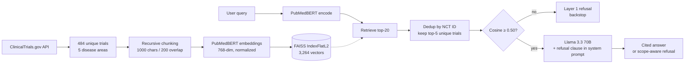

# Clinical Trial Intelligence System

A retrieval-augmented question-answering system over 484 ClinicalTrials.gov
studies. Built end-to-end: data ingestion, recursive chunking, biomedical
embeddings, FAISS retrieval, LLM generation with citations, two-layer safety,
and RAGAS-equivalent evaluation across three chunk sizes.

**Live demo:** *[Streamlit URL — deploy pending]*
**Author:** Shrikant Sharma | [LinkedIn](https://www.linkedin.com/in/shrikant-sharma/)

---

## Why this project

Most public RAG demos answer questions about Wikipedia or generic PDFs.
Clinical trial data is harder in three specific ways, and a portfolio project
that ignores them ends up looking like a tutorial copy-paste.

**Domain vocabulary.** General-purpose sentence embeddings collapse medical
synonyms. `pembrolizumab` and `Keytruda` are the same drug, but
`all-MiniLM-L6-v2` scored them at 0.24 cosine similarity in early testing.
That silently breaks retrieval the moment a user types a brand name.

**Life-impacting answers.** A confidently wrong answer about insulin dosing
in pregnancy is the worst possible failure mode. In clinical RAG, a graceful
refusal that names the gap is more valuable than a fluent best guess.

**Document structure.** The same words mean different things in different
sections of a trial protocol. "OTC cold remedies" listed in
*concomitant-medication exclusion criteria* is not a treatment recommendation.
A chunker that fragments these sections can lose framing entirely, and the
LLM downstream can confabulate from the fragments. The chunking sweep in this
project tested whether the deployed parameters were robust to this; they were.

This project ships a working system that handles all three, then evaluates
honestly against each failure mode.

---

## Architecture



The indexing pipeline runs once. The query pipeline runs per request, in
roughly 1.5 seconds end-to-end (PubMedBERT loaded once at app startup via
`@st.cache_resource`).

---

## Key design decisions

### PubMedBERT over MiniLM and OpenAI embeddings

The first version of the embedding pipeline used `all-MiniLM-L6-v2`. Testing
domain pairs surfaced the failure mode immediately:

```
pembrolizumab ↔ Keytruda     0.24    (same drug)
aspirin ↔ heart attack       0.20    (related)
pembrolizumab ↔ lung cancer  0.29    (related)
```

A model that puts a drug and its brand name at 0.24 will never retrieve trials
that use the brand name when the user types the generic, or vice versa. The
fix was to switch to a model trained on biomedical literature.

```python
EMBEDDING_MODEL = "pritamdeka/S-PubMedBert-MS-MARCO"
# 768-dim, trained on 14M PubMed abstracts via MS-MARCO sentence-transformers head
# Recognizes drug brand/generic synonyms and biomedical terminology
```

OpenAI's `text-embedding-3-small` would also have worked. PubMedBERT was
chosen for two reasons: it runs locally with no per-query cost, and the
`pritamdeka/S-PubMedBert-MS-MARCO` variant is specifically tuned for retrieval
rather than general semantic similarity.

### Groq Llama 3.3 70B as the generator

Free tier, OpenAI-compatible API, fast enough for an interactive UI
(typically 1 to 2 seconds per answer). The model name is parameterized in
`src/rag.py` after a mid-build experience with Groq deprecating a model
version with no warning:

```python
LLM_MODEL = "llama-3.3-70b-versatile"
```

The system prompt is model-portable. Swap in any chat model that takes a
`messages` parameter and the rest of the pipeline is unchanged.

### Recursive chunking, 1000 characters, 200 overlap

```python
splitter = RecursiveCharacterTextSplitter(
    chunk_size=1000,
    chunk_overlap=200,
    separators=["\n\n", "\n", ". ", " ", ""],
    length_function=len,
)
```

The recursive splitter tries separators in order: paragraph breaks first,
then line breaks, then sentence endings, then words, then characters as a
last resort. Each chunk lands on the most natural boundary that fits the
size budget.

The sentence separator (`". "`) matters. A fixed-size splitter with no
sentence awareness will cheerfully shred a phrase like "hazard ratio for
overall survival" mid-clause. The recursive splitter prefers a slightly-too-
short chunk that ends at a sentence boundary over a perfect-size chunk that
bisects a key phrase.

Chunks under 100 characters are filtered before embedding. These are
typically stray section headers (`"Exclusion Criteria:"`) that generate
near-zero-information embeddings and pollute retrieval. 87 of 3,351 raw
chunks are dropped at this step.

### Over-fetch and deduplicate by NCT ID, not MMR

Multiple chunks from the same trial often score similarly. Without dedup, a
top-5 retrieval might return 5 chunks but only 3 unique trials, crowding out
relevant trials at lower ranks.

```python
def retrieve(query, model, index, chunks, k=5, fetch_multiplier=4):
    # Fetch 4*k = 20 candidates from FAISS
    # Walk in score order, keep best-scoring chunk per nct_id
    # Return top-5 unique trials
```

Maximal Marginal Relevance (MMR) was considered as the alternative. MMR
penalizes new results based on similarity to already-selected ones, which
encourages topical diversity within the result set. For clinical
question-answering, *source* diversity (5 different trials) matters more
than *result* diversity (5 different topical angles), so deduplication by
NCT ID is the right call. MMR also has a tunable lambda parameter that
would need its own evaluation. Dedup is parameter-free and explainable.

### Two-layer safety

Layer 1 is a cosine similarity threshold. Layer 2 is an LLM refusal clause
in the system prompt. Both layers are designed to fail safely.

```python
SYSTEM_PROMPT = """You are a clinical trial research assistant. You answer
questions strictly using the trial excerpts provided in the context. Follow
these rules:

1. If the context does not contain enough information to answer, say:
   "I don't have enough information in the retrieved trials to answer that question."
   Do not guess. Do not use general medical knowledge.

2. Cite every claim by NCT ID in square brackets, e.g. [NCT01234567].

3. If the question is not about clinical trials or medical research, say:
   "This question is outside the scope of the clinical trial database."

4. Be concise. Two to four sentences unless the question requires more.
"""
```

The four-case validation in early testing established that the two layers
catch different failure modes:

| Case | Top-1 cosine | Caught by | Why it matters |
|---|---|---|---|
| Sourdough bread (OOD) | 0.857 | Layer 2, out-of-scope rule | Layer 1 cannot catch this; PubMedBERT puts cooking at 0.85 |
| Python syntax (OOD) | 0.864 | Layer 2, out-of-scope rule | Same failure mode, different content |
| Insulin dosing in pregnancy | 0.934 | Layer 2, no-info rule | Retrieval succeeds on diabetes trials, but the chunks lack dosing specifics; only the LLM can see this |
| BRAF V600E in melanoma | 0.937 | Passed, cited answer produced | Control: confirms the strict rules don't over-refuse |

The honest finding from the chunking sweep evaluation (below) is that
**Layer 1 never fires in practice**. Adversarial out-of-domain queries
score 0.86 to 0.91, well above the 0.50 threshold. Layer 2 is the primary
safety mechanism. Layer 1 remains as a backstop for the case where the
LLM is bypassed or fails open. Raising the threshold is not a fix:
legitimate medical queries also score in the 0.85+ band.

---

## Evaluation

Three independent evaluation passes were run during development.

### 1. Stress test: 25 queries, 6 categories

The first evaluation ran 25 queries across 6 categories through the deployed
pipeline:

- 4 control-easy in-corpus queries (BRAF, pembrolizumab, HER2, heart failure)
- 5 in-domain oncology, more specific
- 4 in-domain cardio/metabolic
- 4 in-domain-specific edge cases (insulin dosage, radiation dose, drug interactions)
- 4 out-of-domain (sourdough, Python, hiking, plumbing)
- 4 adversarial-medical (medical-sounding but not in corpus)

22 of 25 outcomes matched the predicted behavior (cited-answer or refusal).
Zero of four adversarial-medical queries leaked confabulated answers. The
investigation into the three queries that didn't match expectation surfaced
a real corpus-vocabulary limitation: the system retrieved the correct trials
for "antibody-drug conjugates in HER2-positive cancer" but ranked the
trastuzumab-deruxtecan chunk lower than expected. The corpus contained the
chunk; retrieval recovered it; the LLM's answer correctly hedged the
HER2-low vs HER2-positive distinction. Documented in Limitations below.

### 2. Chunking sweep: 3 chunk sizes, RAGAS-equivalent metrics

The deployed system uses 1000-character chunks. To validate that choice
against alternatives, the same 484 trials were re-chunked at 500 and 1500
characters with identical splitter parameters (overlap=200, same five
separators, same min-chunk filter), then evaluated end-to-end.

Six in-corpus queries plus four adversarial queries, each through the full
RAG pipeline at all three chunk sizes (30 runs total). The 18 in-corpus runs
were scored on three RAGAS-equivalent metrics, judged by the same
Llama 3.3 70B used for generation:

- **Faithfulness**: percentage of atomic claims in the answer supported by
  the retrieved context (claims decomposed by LLM, each verified against context)
- **Context precision**: percentage of retrieved chunks judged relevant to
  the question
- **Refusal handling**: faithfulness is not meaningful when the system
  refuses; refusals are reported separately

The metrics were implemented directly rather than via the RAGAS package due
to dependency conflicts with `langchain-openai` on Python 3.13. The
implementation lives in `notebooks/03_chunking_sweep.ipynb`.

**In-corpus results (6 queries × 3 sizes):**

| Size | Total | Answered | Refused | Refusal rate | Faithfulness (when answered) | Context precision | Mean claims/answer |
|---|---|---|---|---|---|---|---|
| 500 | 6 | 3 | 3 | 50% | 0.69 | 0.47 | 6.7 |
| **1000** | 6 | 2 | 4 | 67% | 0.77 | 0.40 | 6.5 |
| 1500 | 6 | 2 | 4 | 67% | 1.00 (n=2) | 0.33 | 7.5 |

**Adversarial results (4 queries × 3 sizes):**

| Size | Refusal rate | Mean adversarial top-score |
|---|---|---|
| 500 | 100% | 0.869 |
| 1000 | 100% | 0.863 |
| 1500 | 100% | 0.862 |

**Per-query outcomes (in-corpus):**

| Query | 500 | 1000 | 1500 |
|---|---|---|---|
| pembrolizumab in NSCLC | answered | answered | answered |
| BRAF V600E mutation | answered | answered | answered |
| antibody-drug conjugates HER2+ | answered | refused | refused |
| hazard ratios in phase 3 | refused | refused | refused |
| eligibility age 65+ | refused | refused | refused |
| CAR-T for leukemia | refused | refused | refused |

**The headline finding is about refusal behavior, not chunk size.** The
system refused 4 of 6 in-corpus queries (67% at the deployed 1000-char size)
where the corpus did not contain answer-grade content. The refusals were
specific. For the age-65+ query, the model said: *"trials specify age ranges
18 to 75 years and ≥18 years, but none enroll 65+."* For the CAR-T query:
*"the provided trials focus on solid tumors such as lung cancer, but do not
mention leukemia or lymphoma."* The model retrieved chunks, recognized the
gap, and refused with citations. That is what good clinical RAG looks like.

**The chunking choice does not meaningfully affect safety.** Five of six
queries had identical answered/refused outcomes across all three sizes. The
only point of disagreement is the antibody-drug-conjugate query: 500-char
answered (correctly hedged), 1000 and 1500 refused. All three answers were
correct in the sense that none confabulated. They represent a gradient of
caution: 500-char gave a useful partial answer, 1000-char refused with
citations and reasoning, 1500-char refused without elaboration.

**The 0.40 mean context precision deserves a methodology note.** Qualitative
inspection of representative queries (BRAF V600E, pembrolizumab) showed that
all five retrieved chunks were topically relevant; the LLM judge applied a
strict "directly answers the question" criterion that penalized chunks where
query terms appeared in inclusion/exclusion criteria rather than trial
design. Treating the 0.40 as evidence of poor retrieval would be misleading.
A dedicated cross-encoder reranker is the natural Phase 2 improvement.

### 3. Verdict

The deployed system uses 1000-character chunks. The corrected sweep found
no safety-relevant differences between the three sizes tested, so the
verdict is stability rather than optimization: 1000 is what the 25-query
stress test was run against (22/25 outcomes matched), it sits between the
two extremes, and there is no evidence that migrating to 500 or 1500 would
improve real outcomes. Migration would force re-validation of the safety
behavior the deployed build already demonstrates.

---

## Limitations

The system is a portfolio demonstration, not a production clinical tool.
Specific known limitations:

- **PubMedBERT under-weights numerical constraints.** Queries about specific
  ages, doses, or sample sizes retrieve generic eligibility-criteria
  boilerplate rather than the chunks containing the specific numerical
  value. The embedding matches structural patterns ("Eligibility:
  Inclusion Criteria") more strongly than numerical content.
- **Vocabulary fragility on emerging therapies.** Different chunking
  configurations surface trastuzumab-deruxtecan (T-DXd) chunks at different
  ranks for the same query. Retrieval is not robust to specialized
  terminology that appears once or twice in the corpus.
- **The cosine threshold (Layer 1) does not fire in evaluation.**
  Adversarial queries score 0.86 to 0.91, well above the 0.50 threshold.
  The LLM refusal clause (Layer 2) carries the operational safety load.
  Layer 1 remains as a backstop, but raising it would also reduce recall
  on legitimate medical queries that score in the same band.
- **LLM-as-judge variance.** Context precision averaged 0.40 across the
  three chunk sizes. Inspection showed the retrieved chunks were
  topically relevant; the variance reflects judge strictness, not
  retrieval failure.
- **Evaluation set is small.** 25 queries in the stress test, 10 queries
  in the chunking sweep. Results are directionally meaningful but not
  statistically robust. A 50-100 query gold set with held-out reference
  answers is the natural next step.
- **No reranking, conversational memory, or agentic capabilities.** All
  three are on the roadmap below.

---

## Roadmap

**Phase 2: agentic upgrade with LangGraph.** Query routing (specific NCT
lookup vs semantic search vs follow-up clarification), tool calling for
ClinicalTrials.gov API pulls on cache miss, conversational memory across
turns. Highest-priority next step.

**Reranker.** Cross-encoder (e.g., `cross-encoder/ms-marco-MiniLM-L-6-v2`)
applied to the top-20 candidates before the dedup step. Should improve
context precision more than any further chunking optimization.

**Survival analysis hook.** Integrate Cox proportional hazards and
Kaplan-Meier estimators on retrieved trial outcomes, so questions like
"what is the median PFS for arm B" can be answered structurally rather
than by string matching.

**Hybrid retrieval.** BM25 alongside dense retrieval, fused via reciprocal
rank fusion. Specific numerical and identifier queries (NCT IDs, dose
levels, sample sizes) benefit from lexical matching that dense embeddings
dilute.

---

## What I learned

The technically interesting findings were not the ones I expected when I
started building.

**Embedding model choice mattered more than any tutorial covered.** The
MiniLM Keytruda failure showed up in 30 seconds of testing on domain pairs.
Most public RAG demos never test their embeddings on domain-specific
synonyms; they pick a general-purpose model and ship. For clinical data,
that's the difference between a system that works and a system that
silently fails on every brand-name query.

**The first chunking sweep used mismatched parameters and produced a
finding that was wrong.** The initial sweep tested chunk sizes 500/1000/1500
but used a different overlap (100 vs. production's 200) and a different
separator hierarchy (no sentence separator) for the 500 and 1500 builds.
That sweep flagged a 500-char "leak" on adversarial queries. Re-running
with production-matched parameters showed the leak was a methodology
artifact, not a chunk-size phenomenon. Adversarial refusal is 100% at all
three sizes once the parameters match. A sweep that isn't rigorously
controlled tells a story about the sweep, not the system.

**The cosine threshold I designed never fires in production.** Adversarial
queries score 0.86. The threshold sits at 0.50. The LLM refusal clause
carries 100% of the operational safety load. Building the evaluation
harness was what surfaced this; without running adversarials through the
full pipeline, the threshold would have stayed in `rag.py` looking like it
was doing real work.

**LLM-as-judge variance is real and meaningful.** The mean context precision
metric came back at 0.40. Treating that number as authoritative without
inspecting the chunks the judge marked irrelevant would have produced a
misleading "retrieval is bad" conclusion. The chunks were on-topic. The
judge was strict. Reading the actual judgements before reporting the
aggregate is the difference between a defensible metric and a misleading one.

---

## Tech stack

Python 3.13, sentence-transformers, FAISS, Groq API, LangChain text
splitters, Streamlit, pandas.

---

## Run it locally

```bash
git clone https://github.com/[github-handle]/clinical-trial-rag
cd clinical-trial-rag
pip install -r requirements.txt
echo "GROQ_API_KEY=your_key_here" > .env
streamlit run app.py
```

Reproduce the data pipeline:

```bash
jupyter notebook notebooks/01_data_pipeline.ipynb
```

Reproduce the 25-query stress test:

```bash
jupyter notebook notebooks/02_evaluation.ipynb
```

Reproduce the chunking sweep:

```bash
jupyter notebook notebooks/03_chunking_sweep.ipynb
```

A free Groq API key is sufficient to run the system; the chunking-sweep
evaluation uses approximately 100,000 tokens which fits inside the daily
free-tier budget if run in a single session.

---

## License

MIT. See `LICENSE`.