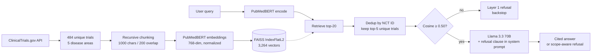
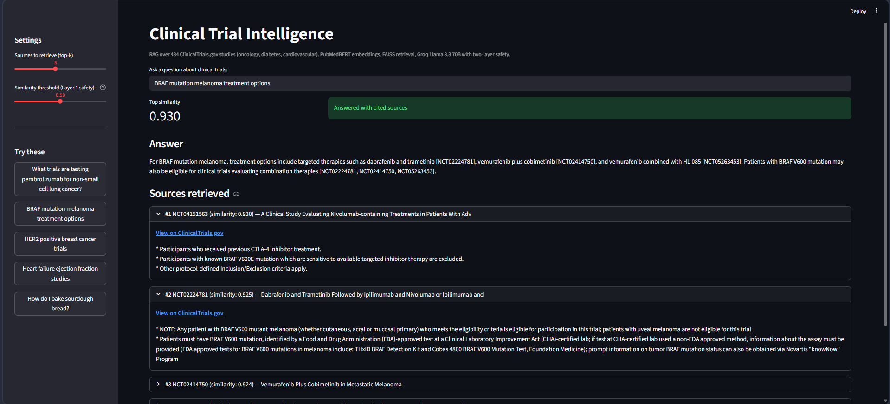
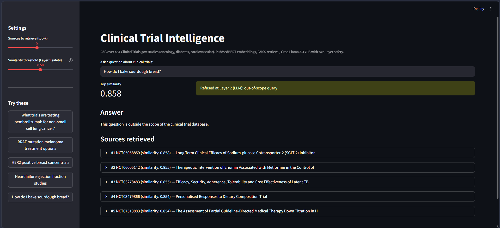
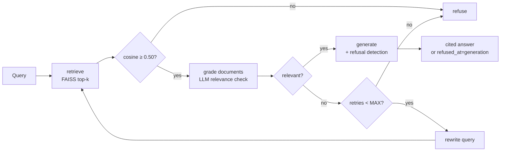
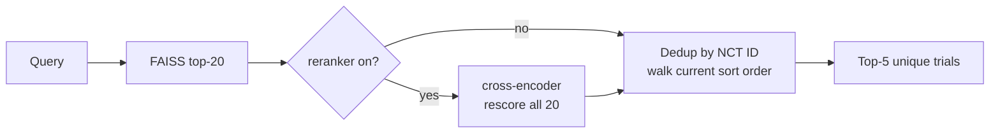

# Clinical Trial Intelligence System

A retrieval-augmented question-answering system over 484 ClinicalTrials.gov
studies. Built end-to-end and offered in two reasoning modes: a baseline
single-shot RAG pipeline, and a LangGraph-orchestrated agentic mode
implementing the Corrective RAG (CRAG) pattern with document relevance
grading, query rewriting on poor retrieval, and bounded retries.

The pipeline covers data ingestion, recursive chunking, biomedical
embeddings, FAISS retrieval, LLM generation with citations, multi-layer
safety (two layers in baseline, three in agentic mode), an optional
cross-encoder reranker applied to both modes for two-stage retrieval, and
RAGAS-equivalent evaluation across three chunk sizes.

**Live demo:** [shrikant-clinical-rag.streamlit.app](https://shrikant-clinical-rag.streamlit.app/)
**Author:** Shrikant Sharma | [LinkedIn](https://www.linkedin.com/in/shrikant-sharma/)

---

## Why this project

Most public RAG demos answer questions about Wikipedia or generic PDFs.
Clinical trial data is harder in three specific ways, and a portfolio project
that ignores them ends up looking like a tutorial copy-paste.

**Domain vocabulary.** General-purpose sentence embeddings collapse medical
synonyms. `pembrolizumab` and `Keytruda` are the same drug, but
`all-MiniLM-L6-v2` scored them at 0.24 cosine similarity in early testing.
That silently breaks retrieval the moment a user types a brand name.

**Life-impacting answers.** A confidently wrong answer about insulin dosing
in pregnancy is the worst possible failure mode. In clinical RAG, a graceful
refusal that names the gap is more valuable than a fluent best guess.

**Document structure.** The same words mean different things in different
sections of a trial protocol. "OTC cold remedies" listed in
*concomitant-medication exclusion criteria* is not a treatment recommendation.
A chunker that fragments these sections can lose framing entirely, and the
LLM downstream can confabulate from the fragments. The chunking sweep in this
project tested whether the deployed parameters were robust to this; they were.

This project ships a working system that handles all three, then evaluates
honestly against each failure mode.

---

## Architecture



The indexing pipeline runs once. The query pipeline runs per request, in
roughly 1.5 seconds end-to-end (PubMedBERT loaded once at app startup via
`@st.cache_resource`).

---

## Example outputs

Two representative interactions from the deployed Streamlit interface: a
successful cited answer on an in-corpus query, and a Layer 2 refusal on an
out-of-domain query.

| In-corpus: "BRAF V600E mutation in melanoma" | Out-of-scope: "how to bake sourdough bread" |
|---|---|
|  |  |

The BRAF response cites the retrieved trials by NCT ID directly in the answer
text. The bread query triggers the system-prompt rule for non-medical
questions and returns a scope-aware refusal without invoking the LLM
generation step on the retrieved chunks.

---

## Key design decisions

### PubMedBERT over MiniLM and OpenAI embeddings

The first version of the embedding pipeline used `all-MiniLM-L6-v2`. Testing
domain pairs surfaced the failure mode immediately:

```
pembrolizumab ↔ Keytruda     0.24    (same drug)
aspirin ↔ heart attack       0.20    (related)
pembrolizumab ↔ lung cancer  0.29    (related)
```

A model that puts a drug and its brand name at 0.24 will never retrieve trials
that use the brand name when the user types the generic, or vice versa. The
fix was to switch to a model trained on biomedical literature.

```python
EMBEDDING_MODEL = "pritamdeka/S-PubMedBert-MS-MARCO"
# 768-dim, trained on 14M PubMed abstracts via MS-MARCO sentence-transformers head
# Recognizes drug brand/generic synonyms and biomedical terminology
```

OpenAI's `text-embedding-3-small` would also have worked. PubMedBERT was
chosen for two reasons: it runs locally with no per-query cost, and the
`pritamdeka/S-PubMedBert-MS-MARCO` variant is specifically tuned for retrieval
rather than general semantic similarity.

### Groq Llama 3.3 70B as the generator

Free tier, OpenAI-compatible API, fast enough for an interactive UI
(typically 1 to 2 seconds per answer). The model name is parameterized in
`src/rag.py` after a mid-build experience with Groq deprecating a model
version with no warning:

```python
LLM_MODEL = "llama-3.3-70b-versatile"
```

The system prompt is model-portable. Swap in any chat model that takes a
`messages` parameter and the rest of the pipeline is unchanged.

### Recursive chunking, 1000 characters, 200 overlap

```python
splitter = RecursiveCharacterTextSplitter(
    chunk_size=1000,
    chunk_overlap=200,
    separators=["\n\n", "\n", ". ", " ", ""],
    length_function=len,
)
```

The recursive splitter tries separators in order: paragraph breaks first,
then line breaks, then sentence endings, then words, then characters as a
last resort. Each chunk lands on the most natural boundary that fits the
size budget.

The sentence separator (`". "`) matters. A fixed-size splitter with no
sentence awareness will cheerfully shred a phrase like "hazard ratio for
overall survival" mid-clause. The recursive splitter prefers a slightly-too-
short chunk that ends at a sentence boundary over a perfect-size chunk that
bisects a key phrase.

Chunks under 100 characters are filtered before embedding. These are
typically stray section headers (`"Exclusion Criteria:"`) that generate
near-zero-information embeddings and pollute retrieval. 87 of 3,351 raw
chunks are dropped at this step.

### Over-fetch and deduplicate by NCT ID, not MMR

Multiple chunks from the same trial often score similarly. Without dedup, a
top-5 retrieval might return 5 chunks but only 3 unique trials, crowding out
relevant trials at lower ranks.

```python
def retrieve(query, model, index, chunks, k=5, fetch_multiplier=4, reranker=None):
    # Fetch 4*k = 20 candidates from FAISS
    # (Optional) cross-encoder rescores all 20 — see Phase 3
    # Walk in score order, keep best-scoring chunk per nct_id
    # Return top-5 unique trials
```

Maximal Marginal Relevance (MMR) was considered as the alternative. MMR
penalizes new results based on similarity to already-selected ones, which
encourages topical diversity within the result set. For clinical
question-answering, *source* diversity (5 different trials) matters more
than *result* diversity (5 different topical angles), so deduplication by
NCT ID is the right call. MMR also has a tunable lambda parameter that
would need its own evaluation. Dedup is parameter-free and explainable.

### Two-layer safety

Layer 1 is a cosine similarity threshold. Layer 2 is an LLM refusal clause
in the system prompt. Both layers are designed to fail safely.

```python
SYSTEM_PROMPT = """You are a clinical trial research assistant. You answer
questions strictly using the trial excerpts provided in the context. Follow
these rules:

1. If the context does not contain enough information to answer, say:
   "I don't have enough information in the retrieved trials to answer that question."
   Do not guess. Do not use general medical knowledge.

2. Cite every claim by NCT ID in square brackets, e.g. [NCT01234567].

3. If the question is not about clinical trials or medical research, say:
   "This question is outside the scope of the clinical trial database."

4. Be concise. Two to four sentences unless the question requires more.
"""
```

The four-case validation in early testing established that the two layers
catch different failure modes:

| Case | Top-1 cosine | Caught by | Why it matters |
|---|---|---|---|
| Sourdough bread (OOD) | 0.857 | Layer 2, out-of-scope rule | Layer 1 cannot catch this; PubMedBERT puts cooking at 0.85 |
| Python syntax (OOD) | 0.864 | Layer 2, out-of-scope rule | Same failure mode, different content |
| Insulin dosing in pregnancy | 0.934 | Layer 2, no-info rule | Retrieval succeeds on diabetes trials, but the chunks lack dosing specifics; only the LLM can see this |
| BRAF V600E in melanoma | 0.937 | Passed, cited answer produced | Control: confirms the strict rules don't over-refuse |

The honest finding from the chunking sweep evaluation (below) is that
**Layer 1 never fires in practice**. Adversarial out-of-domain queries
score 0.86 to 0.91, well above the 0.50 threshold. Layer 2 is the primary
safety mechanism. Layer 1 remains as a backstop for the case where the
LLM is bypassed or fails open. Raising the threshold is not a fix:
legitimate medical queries also score in the 0.85+ band.

---

## Phase 2: Agentic upgrade (Corrective RAG with LangGraph)

The 25-query stress test and the chunking sweep both surfaced the same
finding: **Layer 1 (the cosine similarity threshold) never fires in
practice**. Adversarial out-of-domain queries score 0.86 to 0.91. The
threshold sits at 0.50. PubMedBERT — like most dense bi-encoders — has a
high similarity floor; even gibberish (`asdf qwer zxcv lkjh`) scored 0.914
against the clinical corpus.

The threshold gate was designed for catastrophic OOD only. For borderline
cases where retrieved chunks are topically adjacent but don't actually
answer the question, the threshold offers no defense. The LLM refusal
clause (Layer 2) helped, but it was a single point of failure: a flaky
LLM, a prompt regression, or a model deprecation would silently degrade
safety.

Phase 2 adds a third independent defense: an LLM-as-judge that grades
retrieved documents for relevance to the query before generation, and
retries with a reformulated query if the grade is poor. The architecture
is the **Corrective RAG (CRAG)** pattern from recent agentic-RAG
literature, implemented via LangGraph for the orchestration.

### Why LangGraph (and only for orchestration)

The baseline retrieval and generation path in `rag.py` intentionally
avoids LangChain — embeddings, FAISS, and the Groq client are all called
directly. LangGraph (a library from the LangChain team) is used in
`agent.py` purely for state-machine orchestration: defining nodes,
conditional edges, and the retry loop. Core retrieval and generation are
unchanged. The reasoning:

- **Orchestration is the part LangGraph does well.** State management,
  conditional routing, retry loops with cycle detection — implementing
  these manually is hundreds of lines of boilerplate with subtle bugs.
- **Retrieval is the part where abstraction creates more problems than
  it solves.** LangChain's retrievers add wrappers that hide important
  details (which embedding model, which distance metric, how dedup
  works). Keeping retrieval as direct FAISS + sentence-transformers
  calls means every retrieval decision is visible in source.

The two halves communicate through a typed state schema (`AgentState`,
a `TypedDict`) and shared helpers (`build_context`, `generate_answer`)
that either path can call. The shared helpers also keep the baseline
and agentic paths consistent: a future temperature or prompt tweak in
`generate_answer` flows to both automatically.

### The state machine



Five nodes: `retrieve`, `grade`, `rewrite_query`, `generate`, `refuse`.
Two conditional edges: after `retrieve` (threshold check), after `grade`
(three-way fork on relevance and retry count). The rewrite path loops
back to `retrieve` exactly once before refusing — `MAX_RETRIES = 1` is a
deliberate hyperparameter. Empirically, one rewrite recovers most
vague-question failures; beyond one, the question is usually genuinely
out of scope and refusing is correct.

### Three refusal gates, each catching what the others miss

The agent has three independent refusal paths, each with a distinct
`refused_at` attribution for telemetry:

| Gate | When it fires | What it catches |
|---|---|---|
| `threshold` | top cosine < 0.50 after retrieve | Catastrophic OOD (gibberish, malformed input). Rarely fires in practice. |
| `max_retries_exhausted` | grader returns `not_relevant` after retry | Topically-adjacent but actually irrelevant retrieval — the gap embeddings can't see. |
| `generation` | LLM emits the canonical refusal phrase from `SYSTEM_PROMPT` | On-topic retrieval that doesn't actually contain the answer to the specific question (e.g., asking about side effects against a protocol-only corpus). |

The empirical validation that all three gates do distinct work came from
testing the agent on a single gibberish query (`asdf qwer zxcv lkjh`),
which scored 0.914 cosine similarity. The threshold gate completely
missed it (0.914 ≫ 0.50). The LLM grader correctly judged the retrieved
chunks as `not_relevant`. The rewriter took one shot at recovery,
retrieval still missed, the grader stuck to its judgment, and
`max_retries_exhausted` terminated cleanly. Each gate did something
neither of the others could have done. That's defense in depth, made
literal.

### Two-mode UI for A/B comparison

The Streamlit app exposes both modes as a sidebar toggle:

- **Agentic (CRAG)** — the new flow. Default.
- **Baseline (single-shot)** — original `retrieve → threshold → generate`,
  preserved verbatim.

Both share the same retrieval, embedding model, FAISS index, and base LLM
prompt. The only difference is the orchestration layer. Toggling between
them on the same query is the clearest way to see what grading and retry
add: a vague clinical query like "tell me about pembrolizumab" gets
rewritten in agentic mode (to something like "pembrolizumab clinical
trials phase 3 non small cell lung cancer treatment") and produces a
sharper retrieval, while baseline takes the original query as-is.

---

## Phase 3: Cross-encoder reranker

The chunking-sweep evaluation in the previous build flagged a real
retrieval limitation: context precision averaged 0.40 across all three
chunk sizes, and the trastuzumab-deruxtecan (T-DXd) chunk for the
HER2-positive antibody-drug-conjugate query was ranked lower than the
generic trastuzumab-and-chemotherapy studies. The original Limitations
section called out this exact pattern: *"Different chunking configurations
surface T-DXd chunks at different ranks for the same query. Retrieval is
not robust to specialized terminology that appears once or twice in the
corpus."*

The root cause is structural to the bi-encoder retrieval approach. A
dense bi-encoder embedding (PubMedBERT here) compresses query and document
into separate vectors that get compared by cosine similarity. That's fast
and scales — but the encoder never sees the two together, it only scores
similarity to a global semantic geometry. For specialized clinical
vocabulary that doesn't dominate the corpus (T-DXd appears in only a
handful of protocols), the bi-encoder will rank a more common-vocabulary
chunk above the actually-relevant one, and no threshold or chunking tweak
fixes that.

A cross-encoder reads query and document jointly. It's slower per pair
(no precomputation possible) but dramatically more accurate on relevance
because it sees both at once. The standard production pattern is
two-stage retrieval: cheap dense retrieval for recall, expensive
cross-encoder reranking for precision.

### Architecture: rerank before dedup



A reranker node sits between FAISS retrieval and the dedup step. The
20 candidates from FAISS are rescored by the cross-encoder, then dedup
walks the reranked list. Reranking **before** dedup is the key
architectural choice: it ensures the best chunk per trial (per the
cross-encoder) survives, not just the best FAISS-ranked chunk.

```python
def retrieve(query, model, index, chunks, k=5, fetch_multiplier=4, reranker=None):
    """When reranker is None, behaves identically to the original single-stage
    retrieval. When a cross-encoder is provided, all fetched candidates are
    rescored BEFORE dedup so the cross-encoder chooses which chunk per trial
    survives, not just which order trials appear in. The cosine `score` field
    is preserved on every result so the agent's 0.50 threshold gate stays
    calibrated."""
```

The reranker is `cross-encoder/ms-marco-MiniLM-L-6-v2` — 22M parameters,
about 90MB, fast on CPU (~50ms for 20 query-document pairs). Trained on
the MS-MARCO passage ranking dataset, it generalizes well to clinical
text despite not being domain-specific. A biomedical-tuned cross-encoder
(e.g., a PubMedBERT-MS-MARCO variant) would likely score higher, but the
generic MS-MARCO model already produces a clear improvement on the
documented failure modes, and the 90MB footprint is convenient for
Streamlit Cloud deployment.

### Empirical validation: the HER2 ADC query before and after

The headline qualitative test is the exact query that the Limitations
section called out as a known failure mode — *"Are there trials studying
antibody drug conjugates for HER2-positive cancer?"* — before and after
adding the reranker.

**Without reranker** (bi-encoder cosine ranking):

| Rank | NCT | Cosine | Title |
|---|---|---|---|
| 1 | NCT00004888 | 0.941 | Combination Chemotherapy With or Without Trastuzumab |
| 2 | NCT00499122 | 0.933 | NOV-002, Doxorubicin, Cyclophosphamide, and Docetaxel |
| 3 | NCT04836156 | 0.932 | Neoadjuvant Therapy Study Guided by Drug Screening |
| 4 | NCT02307227 | 0.931 | Phase II Study With Trastuzumab + Paclitaxel |
| 5 | NCT06367088 | 0.929 | Cadonilimab Combined With Chemotherapy |

Top-1 cosine is 0.941. The retrieved chunks are all topically related
(HER2, breast cancer, trastuzumab) but none of them are about
antibody-drug conjugates specifically. The Agentic CRAG mode correctly
**refused** this set: the LLM grader judged the chunks topically related,
but the generator could not produce an ADC-grounded answer, so the
canonical refusal phrase fired and `refused_at="generation"` was
attributed. Layer 3 saved the user from a confabulated answer — exactly
as designed.

**With reranker** (cross-encoder rescoring):

| Rank | NCT | Cosine | Rerank | Title |
|---|---|---|---|---|
| 1 | NCT05710666 | 0.926 | **+5.02** | Neoadjuvant **Trastuzumab Deruxtecan (T-DXd)** |
| 2 | NCT04836156 | 0.932 | +4.67 | Neoadjuvant Therapy Study Guided by Drug Screening |
| 3 | NCT06727227 | 0.926 | +3.84 | Real-world Study of **Trastuzumab Deruxtecan** |
| 4 | NCT07553741 | 0.924 | +3.75 | Imaging Comparison [68Ga]Ga-FAPI-04 PET, [18F]FDG |
| 5 | NCT02307227 | 0.927 | +3.38 | Phase II Study With Trastuzumab + Paclitaxel |

Two T-DXd trials now appear in the top 5. The Agentic CRAG mode produces
a cited answer instead of refusing:

> *"Trastuzumab deruxtecan (T-DXd) is an antibody-drug conjugate (ADC)
> being studied for HER2-positive breast cancer [NCT05710666]. It has
> shown benefits for HER2-low status BC, leading to its EMA approval for
> HER2-low BC in January 2023 [NCT06727227]. In the SHAMROCK study,
> patients with early stage HER2-positive breast cancer receive
> neoadjuvant treatment of T-DXd [NCT05710666]."*

The cosine scores in the reranked top-5 are *lower* than in the
non-reranked top-5 (0.926 vs 0.941). That gap is the point of two-stage
retrieval: a 0.926 T-DXd chunk is more relevant than a 0.941 generic
trastuzumab chunk, and only the cross-encoder can tell the difference.

### Two-mode UI extension

The Streamlit app exposes the reranker as an additional sidebar toggle
that applies to both reasoning modes. A user can run the same query
across all four configurations (Agentic / Baseline × Reranker on / off)
and see exactly which retrieval differences the cross-encoder is buying.
When the reranker is on, retrieved-source expanders display the
`rerank_score` alongside the cosine similarity.

### Quantitative evaluation

A controlled comparison was run on the production chunk size (1000 chars)
with the 6 in-corpus queries × 2 configurations (rerank off, rerank on),
each scored by an LLM-as-judge for faithfulness and context precision.
Implementation in `notebooks/03_chunking_sweep.ipynb` under "Step D —
Reranker comparison."

**Aggregate results (6 in-corpus queries × 2 configs):**

| Config        | Answered | Refused | Refusal rate | Faithfulness (when answered) | Context precision (all) |
|---------------|---------:|--------:|-------------:|-----------------------------:|------------------------:|
| No reranker   | 2        | 4       | 67%          | 0.812                        | 0.067                   |
| With reranker | 4        | 2       | **33%**      | 0.812                        | **0.100**               |

**Headline: refusal rate halved** (67% → 33%) with no degradation in
faithfulness when the system answered. The reranker enabled correct
answers on queries the bi-encoder couldn't surface relevant chunks for,
while preserving answer quality on the queries the baseline already
handled.

**Per-query outcomes:**

| Query                                                  | No reranker | With reranker | Delta              |
|--------------------------------------------------------|-------------|---------------|--------------------|
| pembrolizumab in NSCLC                                 | answered    | answered      | still answered     |
| BRAF V600E mutation in melanoma                        | answered    | answered      | still answered     |
| antibody-drug conjugates for HER2+ breast cancer       | refused     | **answered**  | **FIXED by rerank**|
| eligibility criteria for age 65+                       | refused     | **answered**  | **FIXED by rerank**|
| hazard ratios in phase 3 oncology trials               | refused     | refused       | still refused      |
| CAR-T cell therapy for leukemia                        | refused     | refused       | still refused      |

The HER2 ADC fix is exactly the qualitative validation shown above, now
confirmed by the quantitative pipeline. The eligibility-65+ query is a
second case where two-stage retrieval unlocked an answer that bi-encoder
ranking left buried below the top 5.

**Two queries are still refused — by design, not retrieval failure.**
The hazard-ratios and CAR-T-leukemia queries hit genuine corpus gaps:
the indexed protocols mostly describe eligibility and trial design
rather than summary statistics like hazard ratios, and the oncology
corpus skews solid tumors rather than hematologic malignancies. Both
refusals are specific and citation-aware — the same safety behavior
documented in Section 2 of the Evaluation below.

**On context precision when answered (0.20 → 0.15):** this is a paradox
of progress. The reranker enabled answers on harder queries, which the
strict LLM judge then penalized in its narrow "directly answers the
question" reading of context. The aggregate precision over all six
queries (0.067 → 0.100) is the metric that captures the real
improvement; the precision-when-answered metric is pulled down by the
judge strictness already documented in the chunking-sweep evaluation,
not by retrieval getting worse.

---

## Evaluation

Three independent evaluation passes were run during development.

### 1. Stress test: 25 queries, 6 categories

The first evaluation ran 25 queries across 6 categories through the deployed
pipeline:

- 4 control-easy in-corpus queries (BRAF, pembrolizumab, HER2, heart failure)
- 5 in-domain oncology, more specific
- 4 in-domain cardio/metabolic
- 4 in-domain-specific edge cases (insulin dosage, radiation dose, drug interactions)
- 4 out-of-domain (sourdough, Python, hiking, plumbing)
- 4 adversarial-medical (medical-sounding but not in corpus)

22 of 25 outcomes matched the predicted behavior (cited-answer or refusal).
Zero of four adversarial-medical queries leaked confabulated answers. The
investigation into the three queries that didn't match expectation surfaced
a real corpus-vocabulary limitation: the system retrieved the correct trials
for "antibody-drug conjugates in HER2-positive cancer" but ranked the
trastuzumab-deruxtecan chunk lower than expected. The corpus contained the
chunk; retrieval recovered it; the LLM's answer correctly hedged the
HER2-low vs HER2-positive distinction. **This finding directly motivated
Phase 3 — see "Cross-encoder reranker" above for the architectural fix
and validation.**

### 2. Chunking sweep: 3 chunk sizes, RAGAS-equivalent metrics

The deployed system uses 1000-character chunks. To validate that choice
against alternatives, the same 484 trials were re-chunked at 500 and 1500
characters with identical splitter parameters (overlap=200, same five
separators, same min-chunk filter), then evaluated end-to-end.

Six in-corpus queries plus four adversarial queries, each through the full
RAG pipeline at all three chunk sizes (30 runs total). The 18 in-corpus runs
were scored on three RAGAS-equivalent metrics, judged by the same
Llama 3.3 70B used for generation:

- **Faithfulness**: percentage of atomic claims in the answer supported by
  the retrieved context (claims decomposed by LLM, each verified against context)
- **Context precision**: percentage of retrieved chunks judged relevant to
  the question
- **Refusal handling**: faithfulness is not meaningful when the system
  refuses; refusals are reported separately

The metrics were implemented directly rather than via the RAGAS package due
to dependency conflicts with `langchain-openai` on Python 3.13. The
implementation lives in `notebooks/03_chunking_sweep.ipynb`.

**In-corpus results (6 queries × 3 sizes):**

| Size | Total | Answered | Refused | Refusal rate | Faithfulness (when answered) | Context precision | Mean claims/answer |
|---|---|---|---|---|---|---|---|
| 500 | 6 | 3 | 3 | 50% | 0.69 | 0.47 | 6.7 |
| **1000** | 6 | 2 | 4 | 67% | 0.77 | 0.40 | 6.5 |
| 1500 | 6 | 2 | 4 | 67% | 1.00 (n=2) | 0.33 | 7.5 |

**Adversarial results (4 queries × 3 sizes):**

| Size | Refusal rate | Mean adversarial top-score |
|---|---|---|
| 500 | 100% | 0.869 |
| 1000 | 100% | 0.863 |
| 1500 | 100% | 0.862 |

**Per-query outcomes (in-corpus):**

| Query | 500 | 1000 | 1500 |
|---|---|---|---|
| pembrolizumab in NSCLC | answered | answered | answered |
| BRAF V600E mutation | answered | answered | answered |
| antibody-drug conjugates HER2+ | answered | refused | refused |
| hazard ratios in phase 3 | refused | refused | refused |
| eligibility age 65+ | refused | refused | refused |
| CAR-T for leukemia | refused | refused | refused |

**The headline finding is about refusal behavior, not chunk size.** The
system refused 4 of 6 in-corpus queries (67% at the deployed 1000-char size)
where the corpus did not contain answer-grade content. The refusals were
specific. For the age-65+ query, the model said: *"trials specify age ranges
18 to 75 years and ≥18 years, but none enroll 65+."* For the CAR-T query:
*"the provided trials focus on solid tumors such as lung cancer, but do not
mention leukemia or lymphoma."* The model retrieved chunks, recognized the
gap, and refused with citations. That is what good clinical RAG looks like.

**The chunking choice does not meaningfully affect safety.** Five of six
queries had identical answered/refused outcomes across all three sizes. The
only point of disagreement is the antibody-drug-conjugate query: 500-char
answered (correctly hedged), 1000 and 1500 refused. All three answers were
correct in the sense that none confabulated. They represent a gradient of
caution: 500-char gave a useful partial answer, 1000-char refused with
citations and reasoning, 1500-char refused without elaboration.

**The 0.40 mean context precision deserves a methodology note.** Qualitative
inspection of representative queries (BRAF V600E, pembrolizumab) showed that
all five retrieved chunks were topically relevant; the LLM judge applied a
strict "directly answers the question" criterion that penalized chunks where
query terms appeared in inclusion/exclusion criteria rather than trial
design. Treating the 0.40 as evidence of poor retrieval would be misleading.
A dedicated cross-encoder reranker is the natural improvement — implemented
in Phase 3 above, where the controlled comparison shows refusal rate halving
from 67% to 33% with no faithfulness degradation.

### 3. Verdict

The deployed system uses 1000-character chunks. The corrected sweep found
no safety-relevant differences between the three sizes tested, so the
verdict is stability rather than optimization: 1000 is what the 25-query
stress test was run against (22/25 outcomes matched), it sits between the
two extremes, and there is no evidence that migrating to 500 or 1500 would
improve real outcomes. Migration would force re-validation of the safety
behavior the deployed build already demonstrates.

---

## Limitations

The system is a portfolio demonstration, not a production clinical tool.
Specific known limitations:

- **PubMedBERT under-weights numerical constraints.** Queries about specific
  ages, doses, or sample sizes retrieve generic eligibility-criteria
  boilerplate rather than the chunks containing the specific numerical
  value. The embedding matches structural patterns ("Eligibility:
  Inclusion Criteria") more strongly than numerical content.
- **Vocabulary fragility on emerging therapies — mitigated by Phase 3.**
  Without the reranker, different chunking configurations surface
  trastuzumab-deruxtecan (T-DXd) chunks at different ranks for the same
  query. The cross-encoder reranker added in Phase 3 fixes this for the
  HER2 ADC case (verified quantitatively: refusal rate halves from 67%
  to 33% across the 6-query in-corpus eval); the broader pattern (dense
  bi-encoders struggle with vocabulary that appears in only a handful of
  documents) is structural and applies to any rare clinical term.
- **The cosine threshold (Layer 1) does not fire in evaluation.**
  Adversarial queries score 0.86 to 0.91, well above the 0.50 threshold.
  The LLM refusal clause (Layer 2) and the LangGraph grader (Layer 3)
  carry the operational safety load. Layer 1 remains as a backstop, but
  raising it would also reduce recall on legitimate medical queries that
  score in the same band.
- **LLM-as-judge variance.** Context precision metrics moved across
  evaluation passes — 0.40 average in the chunking sweep, and a stricter
  scoring path in the Phase 3 reranker comparison (aggregate 0.067 → 0.100
  with the reranker; precision-when-answered 0.20 → 0.15, an artifact of
  the judge penalizing newly-unlocked harder queries in its narrow
  "directly answers" reading). Across both passes, qualitative inspection
  showed retrieved chunks were topically relevant — the variance reflects
  judge strictness, not retrieval failure.
- **Evaluation set is small.** 25 queries in the stress test, 10 queries
  in the chunking sweep, 6 in-corpus queries in the reranker comparison.
  Results are directionally meaningful but not statistically robust. A
  50-100 query gold set with held-out reference answers is the natural
  next step.
- **No conversational memory.** Multi-turn dialog where the agent
  remembers context from earlier queries in the session is on the roadmap
  below. Agentic orchestration (CRAG with document grading and retry) was
  added in Phase 2; cross-encoder reranking was added in Phase 3.

---

## Roadmap

**Phase 2: agentic upgrade — DONE.** Corrective RAG (CRAG) pattern via
LangGraph, with document relevance grading, query rewriting on poor
retrieval, and bounded retries. Two-mode UI lets users compare against
the baseline pipeline. See "Phase 2: Agentic upgrade" above for the
architecture and validation.

**Phase 3: cross-encoder reranker — DONE.** `cross-encoder/ms-marco-MiniLM-L-6-v2`
applied to the top-20 FAISS candidates before dedup. Empirically fixes
the documented T-DXd retrieval failure on HER2-positive ADC queries and
halves in-corpus refusal rate from 67% to 33% on the 6-query LLM-judged
eval with no faithfulness degradation — see "Phase 3: Cross-encoder
reranker" above for the architecture and full validation.

**Items deferred to a future iteration:**

- **Conversational memory.** Multi-turn dialog where the agent
  remembers context from earlier queries in the same session.
- **Tool calling for live ClinicalTrials.gov API lookups** on cache
  miss (e.g., user asks about a specific NCT ID not in the indexed
  corpus).
- **Specific-NCT routing** so the agent recognizes `NCT0xxxxxxx`
  patterns and skips semantic retrieval in favor of direct lookup.
- **Biomedical cross-encoder.** Swap the generic MS-MARCO reranker
  for a PubMedBERT-MS-MARCO variant. Likely improves the long tail of
  rare-vocabulary queries that even the generic cross-encoder cannot
  resolve.

**Survival analysis hook.** Integrate Cox proportional hazards and
Kaplan-Meier estimators on retrieved trial outcomes, so questions like
"what is the median PFS for arm B" can be answered structurally rather
than by string matching.

**Hybrid retrieval.** BM25 alongside dense retrieval, fused via reciprocal
rank fusion. Specific numerical and identifier queries (NCT IDs, dose
levels, sample sizes) benefit from lexical matching that dense embeddings
dilute.

---

## What I learned

The technically interesting findings were not the ones I expected when I
started building.

**Embedding model choice mattered more than any tutorial covered.** The
MiniLM Keytruda failure showed up in 30 seconds of testing on domain pairs.
Most public RAG demos never test their embeddings on domain-specific
synonyms; they pick a general-purpose model and ship. For clinical data,
that's the difference between a system that works and a system that
silently fails on every brand-name query.

**The first chunking sweep used mismatched parameters and produced a
finding that was wrong.** The initial sweep tested chunk sizes 500/1000/1500
but used a different overlap (100 vs. production's 200) and a different
separator hierarchy (no sentence separator) for the 500 and 1500 builds.
That sweep flagged a 500-char "leak" on adversarial queries. Re-running
with production-matched parameters showed the leak was a methodology
artifact, not a chunk-size phenomenon. Adversarial refusal is 100% at all
three sizes once the parameters match. A sweep that isn't rigorously
controlled tells a story about the sweep, not the system.

**The cosine threshold I designed never fires in production.** Adversarial
queries score 0.86. The threshold sits at 0.50. The LLM refusal clause
carries 100% of the operational safety load. Building the evaluation
harness was what surfaced this; without running adversarials through the
full pipeline, the threshold would have stayed in `rag.py` looking like it
was doing real work.

**LLM-as-judge variance is real and meaningful.** The mean context precision
metric came back at 0.40. Treating that number as authoritative without
inspecting the chunks the judge marked irrelevant would have produced a
misleading "retrieval is bad" conclusion. The chunks were on-topic. The
judge was strict. Reading the actual judgements before reporting the
aggregate is the difference between a defensible metric and a misleading one.

**Defense in depth means each layer can be lenient.** The threshold gate
at 0.50 doesn't catch most OOD — natural-language gibberish scores 0.91.
That used to feel like a problem with the threshold. After adding the
LLM relevance grader as a second independent defense, the lenience of
any single gate stopped mattering: as long as one of the three
(threshold, grader, max-retries) catches each OOD case, the system is
safe. Each gate can specialize — threshold for speed, grader for
semantic precision, retry-cap for guarantees. This is why defense in
depth beats a single perfect filter in practice, and it's the
architectural argument for the agentic upgrade as much as anything in
the CRAG paper.

**LangGraph state mutation has a learning curve worth flagging.**
TypedDict for state is idiomatic and lightweight, but each node must
return a *partial* state dict that LangGraph merges into the full state
— not the full state directly, or you'd lose other nodes' updates.
Conditional edge functions are pure routing (they return a string), not
state mutators. Getting these conventions right took two debugging
cycles; once the pattern was clear, every subsequent node was 10 lines
and didn't need re-explanation.

**Bi-encoder similarity floors are a property of the model class, not a
bug to fix.** When the evaluation showed 0.40 context precision and
adversarial queries scoring 0.91, the instinct was to chase tighter
embeddings or a higher threshold. Neither would have worked. The
bi-encoder compresses query and document into separate vectors before
comparison — it never sees them together. For specialized clinical
vocabulary that doesn't dominate the corpus (T-DXd appears in only a
handful of protocols), the bi-encoder will rank a common-vocabulary
chunk above the actually-relevant one, and no threshold tightens away
the gap. The cross-encoder reranker isn't a *replacement* for the
bi-encoder; it's a different kind of computation the bi-encoder
fundamentally cannot do, and once I understood that, two-stage retrieval
stopped feeling like a "fix" and started feeling like a class-of-model
boundary I had been ignoring. The Phase 3 numbers confirmed the
intuition: halving the refusal rate without touching the bi-encoder, by
adding a model class that can do something the bi-encoder structurally
cannot.

---

## Tech stack

Python 3.13, sentence-transformers (PubMedBERT bi-encoder + MS-MARCO
cross-encoder reranker), FAISS, Groq API, LangGraph (agentic
orchestration), LangChain text splitters (recursive chunking only),
Streamlit, pandas.

---

## Run it locally

```bash
git clone https://github.com/Shrikant-Sharma/clinical-trial-rag
cd clinical-trial-rag
pip install -r requirements.txt
echo "GROQ_API_KEY=your_key_here" > .env
streamlit run app.py
```

Reproduce the data pipeline:

```bash
jupyter notebook notebooks/01_data_pipeline.ipynb
```

Reproduce the 25-query stress test:

```bash
jupyter notebook notebooks/02_evaluation.ipynb
```

Reproduce the chunking sweep (and the Phase 3 reranker comparison in Step D):

```bash
jupyter notebook notebooks/03_chunking_sweep.ipynb
```

A free Groq API key is sufficient to run the system. The full chunking-sweep
evaluation uses approximately 100,000 tokens which fits inside the daily
free-tier budget if run in a single session; the Phase 3 reranker comparison
in Step D adds approximately 40,000 tokens on top, so plan accordingly.

---

## License

MIT. See [LICENSE](LICENSE).